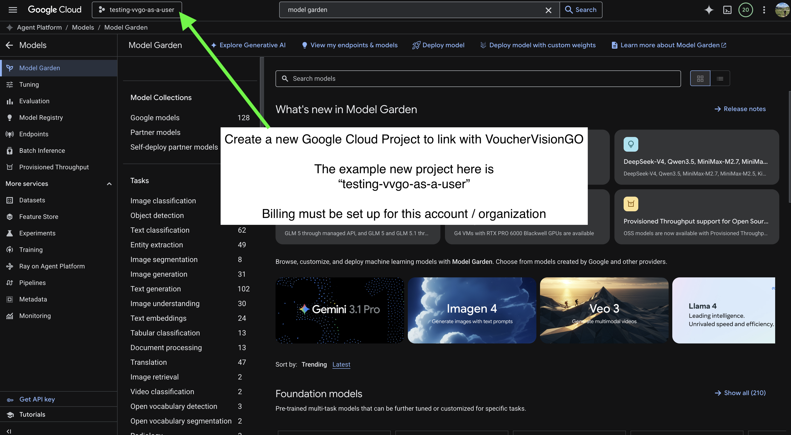
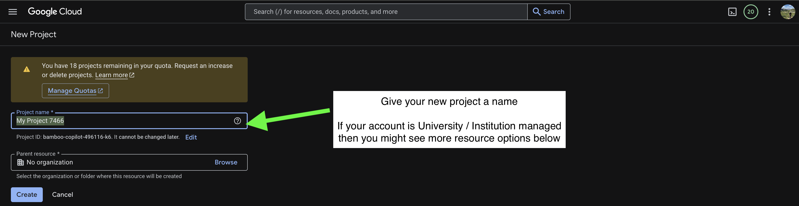
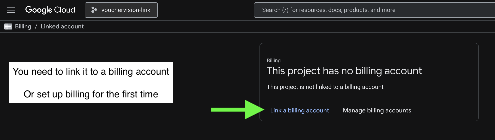
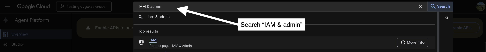
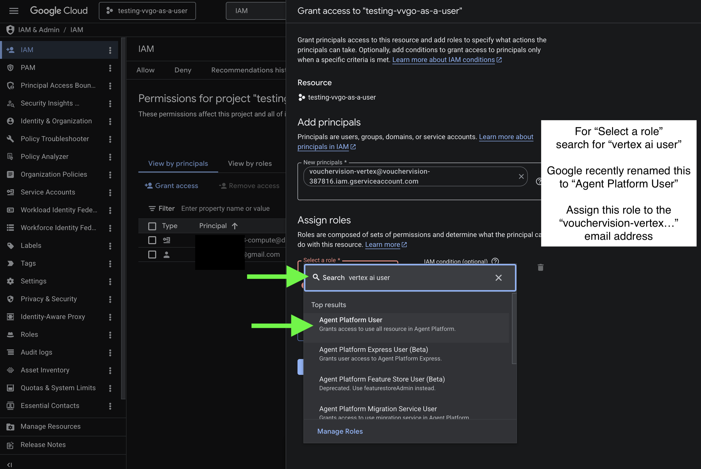

# Bill Gemini calls to your own Google Cloud project (Vertex AI)

This guide walks you through setting up your own Google Cloud project so that
the VoucherVisionGO server can run Gemini calls **on your billing account**
instead of ours, letting you bypass our rate limits. 

Use this path if:

- Google AI Studio API keys aren't available in your region.
- Your organization (university, employer, etc.) requires that AI costs land on
  an institutional Google Cloud account.
- Your organization only allows you to use Enterprise-grade services
- You'd rather not paste a long-lived AI Studio key into an API request.

The trust model is simple: VoucherVisionGO's Cloud Run service runs as a stable,
public service account. You grant that service account the **Vertex AI User**
role on *your* project. 

The VoucherVisionGO server then calls Vertex AI on your behalf, billing
follows the project ID that you provide in your API call. You should treat this project name as if it were a sensitive API key; don't share it, don't make it public, treat it like a password. 

We never see or store your Google Cloud credentials. This process is called "cross-project Service Account delegation," please reach out if you have any questions. 

The VoucherVisionGO service account email you'll grant access to is:

```
vouchervision-vertex@vouchervision-387816.iam.gserviceaccount.com
```

---

## Prerequisites

- A Google account that can create Google Cloud projects.
- A credit card or institutional billing account you can attach to the project.
  Vertex AI is a paid API — calls will not run without billing enabled.

---

## Step 1 — Create a new Google Cloud project

Go to [console.cloud.google.com](https://console.cloud.google.com), click the
project picker at the top, and choose **New project**.



Give the project a name. If your Google account is managed by an institution
(university, employer), you may see additional "Parent resource" / organization
options below the name field — pick the appropriate organization or leave it
as "No organization" for a personal project.


Once the project is created, switch to it using the project picker at the top
of the console. The example throughout this guide uses a project named
`testing-vvgo-as-a-user`.

**Important:** the **Project ID** (the slug shown under the name field when
creating the project, e.g. `testing-vvgo-as-a-user`) is what you pass to
VoucherVisionGO later — *not* the display name. Note it down.



---

## Step 2 — Link a billing account

Open **Billing** from the left-hand navigation (or search for "Billing" in the
top search bar). If the project doesn't have a billing account yet, you'll see
"This project has no billing account."

Click **Link a billing account**. If you've never used Google Cloud billing
before, you'll be taken through a one-time billing-account setup flow first.



---

## Step 3 — Enable the Vertex AI / Agent Platform API

Google recently rebranded **Vertex AI** to **Agent Platform**. The underlying
API is the same.

Search for "Agent Platform" (or "Vertex AI") in the top search bar and open the
product page. You'll see a banner at the top of the overview page:
**Enable APIs to access full platform capabilities**. Click **Enable APIs**.


---

## Step 4 — Grant the VoucherVisionGO service account access

This is the step that actually authorizes the VoucherVisionGO server to make
Vertex AI calls billed to your project.

Search for **IAM & admin** in the top search bar and open the IAM page.



On the IAM page, confirm the project name shown at the top is your new project,
then click **+ Grant access**. In the "Add principals" field, paste
VoucherVisionGO's service account email:

```
vouchervision-vertex@vouchervision-387816.iam.gserviceaccount.com
```


In the **Assign roles** section, click the role dropdown and search for
**vertex ai user**. Google recently renamed this role — in the UI it now
appears as **Agent Platform User** (same underlying `roles/aiplatform.user`).
Select it.



Click **Save**.


---

## Step 5 — Call the VoucherVisionGO API with your project

Pass `vertex_project` (your Project ID from Step 1) and `vertex_region` to
`/process` or `/process-url`. Do **not** also pass `gemini_api_key` — pick one
auth method per request.

### Default models (`gemini-2.5-flash` and the rest of the 2.5 family)

```bash
curl -X POST "https://vouchervision-go-738307415303.us-central1.run.app/process" \
  -H "X-API-Key: <your VVGO API key>" \
  -F "file=@image.jpg" \
  -F "vertex_project=your-project-id" \
  -F "vertex_region=us-central1"
```

Allowed `vertex_region` values (Vertex AI locations where Gemini is hosted):

```
us-central1, us-east4, us-west1,
europe-west1, europe-west2, europe-west3, europe-west4, europe-southwest1,
asia-northeast1, asia-southeast1, asia-south1,
australia-southeast1,
me-central1, me-central2,
northamerica-northeast1, southamerica-east1,
global
```

### Gemini-3 preview models — **must** use `vertex_region=global`

Gemini-3 previews (`gemini-3-pro-preview`, `gemini-3.1-pro-preview`,
`gemini-3-flash-preview`, `gemini-3.1-flash-lite`) are currently
published only in the `global` Vertex AI catalog. Passing a regional value here
will return a 404.

```bash
curl -X POST "https://vouchervision-go-738307415303.us-central1.run.app/process" \
  -H "X-API-Key: <your VVGO API key>" \
  -F "file=@image.jpg" \
  -F "engines=gemini-3.1-pro-preview" \
  -F "llm_model=gemini-3.1-pro-preview" \
  -F "vertex_project=your-project-id" \
  -F "vertex_region=global"
```

Python via `requests`:

```python
import requests

requests.post(
    "https://vouchervision-go-738307415303.us-central1.run.app/process",
    headers={"X-API-Key": "<your VVGO API key>"},
    data={
        "vertex_project": "your-project-id",
        "vertex_region": "us-central1",
    },
    files={"file": open("image.jpg", "rb")},
)
```

---

## Verify billing lands on your project

In the Google Cloud Console for your project, open **Billing → Reports** (or
**Billing → Cost table**). After a successful request, you should see Vertex AI
line items under your project. If you don't, billing is still on the server's
project — recheck the IAM grant and the Project ID you passed.

---

## Revoke access later

If you want to stop the VoucherVisionGO server from billing your project,
return to **IAM & admin → IAM**, find the row for
`vouchervision-vertex@vouchervision-387816.iam.gserviceaccount.com`, click the
trash icon next to it, and save. The next API call with that `vertex_project`
will fail with a 403.

---

## Troubleshooting

### `403 Vertex AI call denied for project '<your-project>'`

The IAM grant is missing, on the wrong project, or the wrong role. Re-check
Step 4:

- The principal email is exactly
  `vouchervision-vertex@vouchervision-387816.iam.gserviceaccount.com`
  (no typos — the SA must exist as published).
- The role is **Vertex AI User** / **Agent Platform User**
  (`roles/aiplatform.user`), not Viewer or Editor.
- You're granting on the same project whose ID you're passing as
  `vertex_project`.

### `404 Vertex AI does not have model '<model>' available in region '<region>'`

The model isn't published in that region's Vertex AI catalog. The most common
cause: gemini-3.x previews aren't in regional catalogs yet — retry with
`vertex_region=global`. For all other models, open **Model Garden** in your
project and check the model card for the regions where it's available.

### `400 Pass either gemini_api_key OR vertex_project, not both.`

Pick one auth method per request. Remove `gemini_api_key` if you want to bill
to your Vertex project.

### `400 vertex_project requires vertex_region.` (or vice versa)

Both flags must be supplied together.

### `400 vertex_region '<value>' is not a supported Vertex AI region.`

Typo in the region name. See the allowed list in Step 5. Note the value is
`us-central1`, not `us-central-1`.
