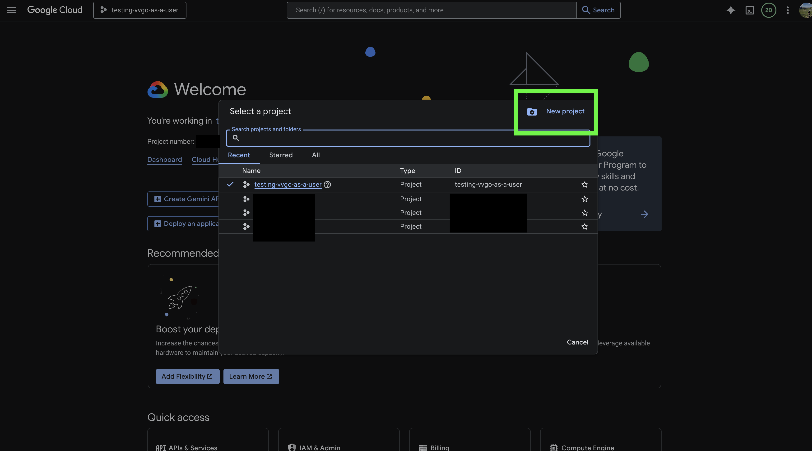
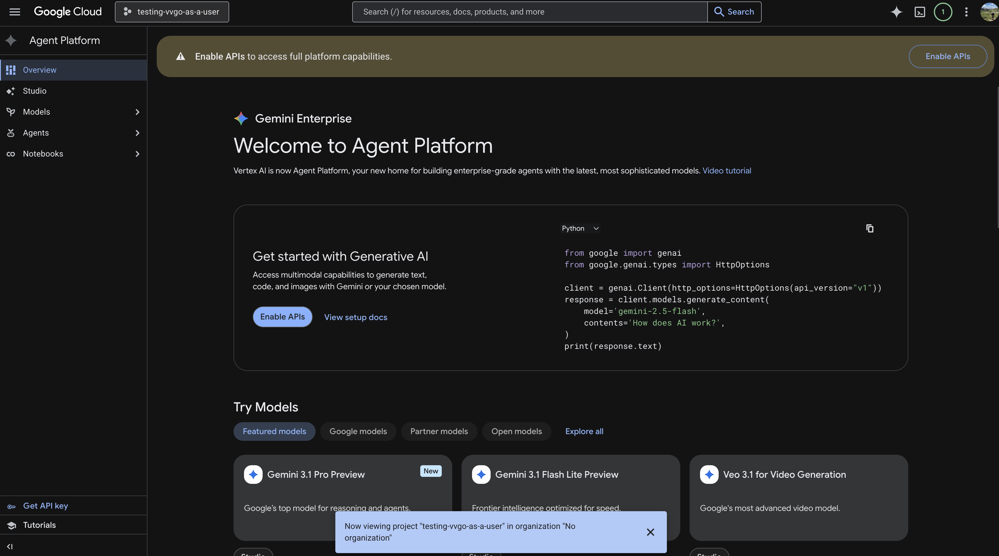
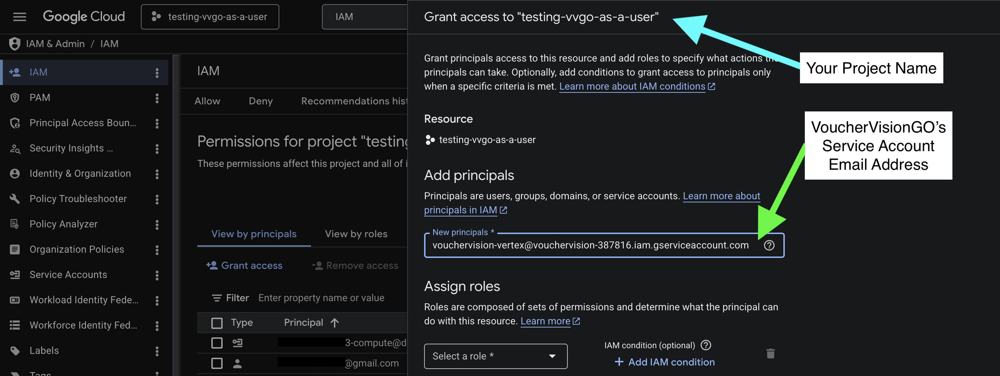
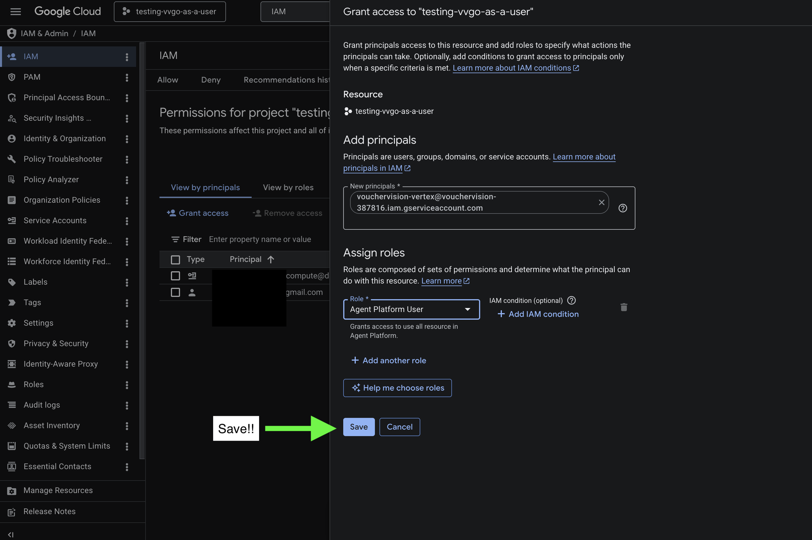
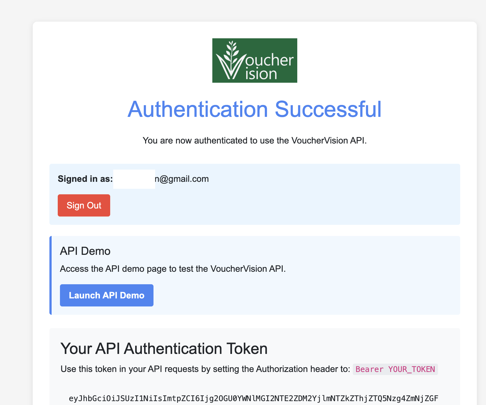
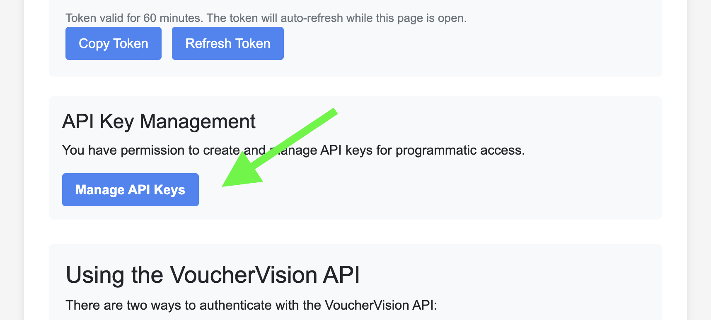
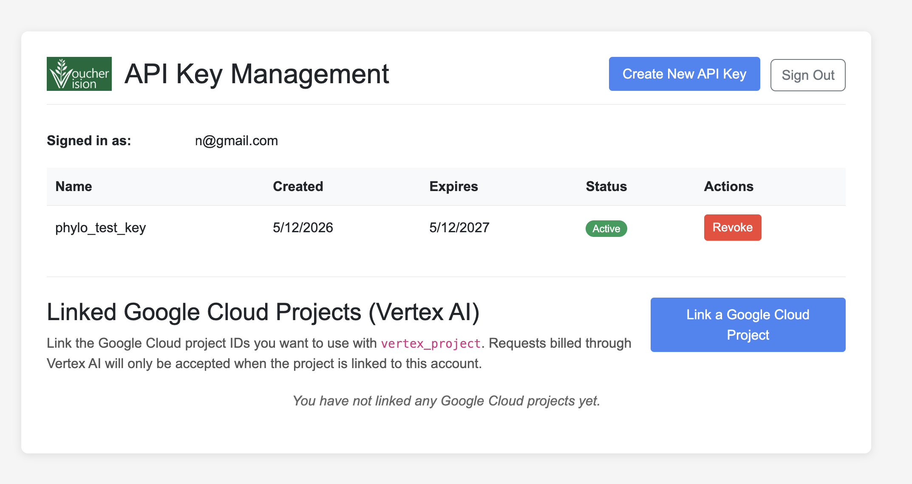
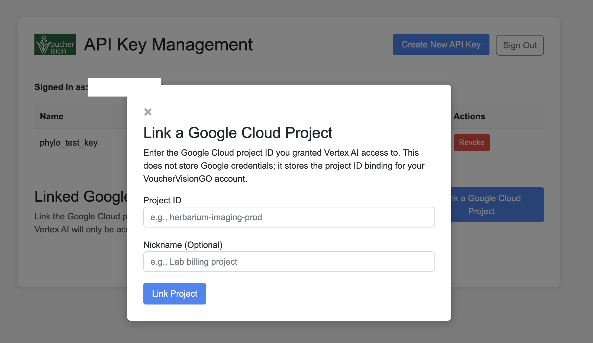
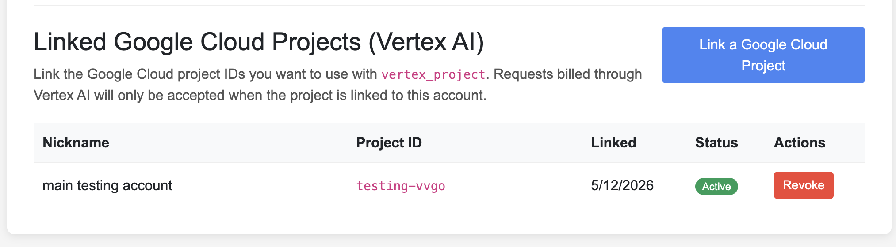
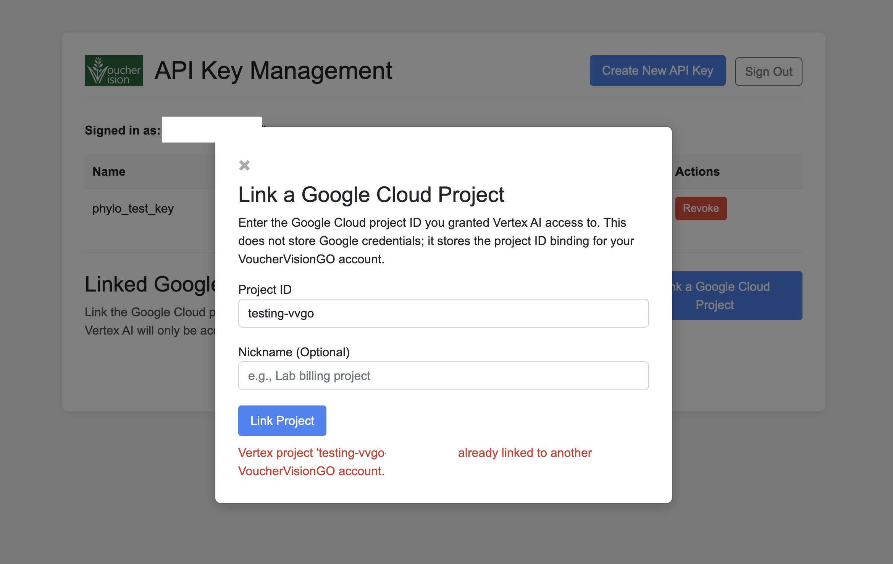

# Bill Gemini calls to your own Google Cloud project (Vertex AI)

This guide walks you through setting up your own Google Cloud project so that
the VoucherVisionGO server can run Gemini calls **on your billing account**
instead of ours, letting you bypass our rate limits. 

Use this path if:

- Google AI Studio API keys aren't available in your region.
- Your organization (university, employer, etc.) requires that AI costs land on
  an institutional Google Cloud account.
- Your organization only allows you to use Enterprise-grade services
- You'd rather not paste a long-lived AI Studio key into an API request.

The trust model is simple: VoucherVisionGO's Cloud Run service runs as a stable,
public service account. You grant that service account the **Vertex AI User**
role on *your* project. 

The VoucherVisionGO server then calls Vertex AI on your behalf, billing
follows the project ID that you provide in your API call. VoucherVisionGO now
requires that the project ID be linked to your VVGO account before API calls
using `vertex_project` will be accepted.

We never see or store your Google Cloud credentials. This process is called "cross-project Service Account delegation," please reach out if you have any questions. 

The VoucherVisionGO service account email you'll grant access to is:

```
vouchervision-vertex@vouchervision-387816.iam.gserviceaccount.com
```

---

## Prerequisites

- A Google account that can create Google Cloud projects.
- A credit card or institutional billing account you can attach to the project.
  Vertex AI is a paid API — calls will not run without billing enabled.

---

## Step 1 — Create a new Google Cloud project

Go to [console.cloud.google.com](https://console.cloud.google.com), click the
project picker at the top, and choose **New project**.


Give the project a name. If your Google account is managed by an institution
(university, employer), you may see additional "Parent resource" / organization
options below the name field — pick the appropriate organization or leave it
as "No organization" for a personal project.



Once the project is created, switch to it using the project picker at the top
of the console. The example throughout this guide uses a project named
`testing-vvgo-as-a-user`.

**Important:** the **Project ID** (the slug shown under the name field when
creating the project, e.g. `testing-vvgo-as-a-user`) is what you pass to
VoucherVisionGO later — *not* the display name. Note it down.


---

## Step 2 — Link a billing account

Open **Billing** from the left-hand navigation (or search for "Billing" in the
top search bar). If the project doesn't have a billing account yet, you'll see
"This project has no billing account."

Click **Link a billing account**. If you've never used Google Cloud billing
before, you'll be taken through a one-time billing-account setup flow first.


---

## Step 3 — Enable the Vertex AI / Agent Platform API

Google recently rebranded **Vertex AI** to **Agent Platform**. The underlying
API is the same.

Search for "Agent Platform" (or "Vertex AI") in the top search bar and open the
product page. You'll see a banner at the top of the overview page:
**Enable APIs to access full platform capabilities**. Click **Enable APIs**.



---

## Step 4 — Grant the VoucherVisionGO service account access

This is the step that actually authorizes the VoucherVisionGO server to make
Vertex AI calls billed to your project.

Search for **IAM & admin** in the top search bar and open the IAM page.


On the IAM page, confirm the project name shown at the top is your new project,
then click **+ Grant access**. In the "Add principals" field, paste
VoucherVisionGO's service account email:

```
vouchervision-vertex@vouchervision-387816.iam.gserviceaccount.com
```



In the **Assign roles** section, click the role dropdown and search for
**vertex ai user**. Google recently renamed this role — in the UI it now
appears as **Agent Platform User** (same underlying `roles/aiplatform.user`).
Select it.


Click **Save**.



---

## Step 5 — Link the project to your VoucherVisionGO account

Now that Google Cloud is configured, you need to tell VoucherVisionGO which
Google Cloud project ID it should accept from your account. Without this link,
any `/process` request with `vertex_project=…` will be rejected even if the
IAM grant from Step 4 is correct.

**Important rules:**

- A Google Cloud project ID can be linked to **exactly one** VoucherVisionGO
  account. If someone else has already linked it, you'll see an error when
  you try.
- Either you (from API Key Management) or a VoucherVisionGO administrator can
  unlink the project at any time. Unlinking takes effect immediately — the
  next `/process` request using that `vertex_project` returns 403.
- VoucherVisionGO does **not** store any Google Cloud credentials. The only
  thing being stored is the binding between your VVGO account email and the
  project ID string.

### 5a — Sign in to VoucherVisionGO

Go to the VoucherVisionGO web app and sign in with the same account
that owns your VVGO API key. You should see the "Authentication Successful"
page.



### 5b — Open API Key Management

Scroll down to the **API Key Management** section and click **Manage API Keys**.



### 5c — Find the Linked Google Cloud Projects section

On the API Key Management page you'll see your existing API keys at the top
and a new section below titled **Linked Google Cloud Projects (Vertex AI)**.
If you haven't linked a project yet, the table will say "You have not linked
any Google Cloud projects yet."

Click **Link a Google Cloud Project**.



### 5d — Enter your Google Cloud project ID

In the modal, paste the **Project ID** from Step 1 (e.g. `testing-vvgo`,
*not* the display name). Optionally add a nickname to help you remember which
project this is — useful if you link more than one. Click **Link Project**.



The project now appears in the table with status **Active**.



### What if the project is already linked?

If another VoucherVisionGO account has already linked this project ID, you'll
see:

> Vertex project 'your-project-id' already linked to another VoucherVisionGO
> account.



This is by design — one Google Cloud project ID maps to one VoucherVisionGO
email account. If you believe the project is yours and was claimed by mistake,
contact a VoucherVisionGO administrator to unlink it.

### Unlinking later

To stop allowing API calls against your project, click **Revoke** in the
Actions column on the linked-projects table. The next `/process` call with
that `vertex_project` value will return a 403. You can re-link the same
project later from the same VVGO account; that reactivates the binding.

VoucherVisionGO administrators can also unlink any project on your behalf
(for example, if you've lost access to your VVGO account).

---

## Step 6 — Call the VoucherVisionGO API with your project

Pass `vertex_project` (your Project ID from Step 1) and `vertex_region=global`
to `/process` or `/process-url`. Do **not** also pass `gemini_api_key` — pick
one auth method per request.

**Always use `vertex_region=global`.** This works for the entire Gemini model
family on Vertex AI and
matches the recommended path for all VoucherVisionGO users.

Using the VoucherVision Python package:

```python
from VoucherVision import process_vouchers

process_vouchers(
    server="https://vouchervision-go-738307415303.us-central1.run.app/",
    output_dir="./output",
    image="path/to/image.jpg",
    auth_token="<your VVGO API key>",
    vertex_project="your-project-id",   # vertex_region defaults to "global"
)
```

See the [vouchervision-go-client README](https://pypi.org/project/vouchervision-go-client/)
for the full set of parameters (batch processing, URL inputs, output options).

Or with curl directly:

```bash
curl -X POST "https://vouchervision-go-738307415303.us-central1.run.app/process" \
  -H "X-API-Key: <your VVGO API key>" \
  -F "file=@image.jpg" \
  -F "vertex_project=your-project-id" \
  -F "vertex_region=global"
```

For a gemini-3 model, add the engine + llm_model flags:

```bash
curl -X POST "https://vouchervision-go-738307415303.us-central1.run.app/process" \
  -H "X-API-Key: <your VVGO API key>" \
  -F "file=@image.jpg" \
  -F "engines=gemini-3.1-pro-preview" \
  -F "llm_model=gemini-3.1-pro-preview" \
  -F "vertex_project=your-project-id" \
  -F "vertex_region=global"
```

---

## Verify billing lands on your project

In the Google Cloud Console for your project, open **Billing → Reports** (or
**Billing → Cost table**). After a successful request, you should see Vertex AI
line items under your project. If you don't, billing is still on the server's
project — recheck the IAM grant and the Project ID you passed.

---

## Revoke access later

There are two independent ways to stop VoucherVisionGO from billing your
project. Either one is sufficient on its own.

**Option A — Unlink in VoucherVisionGO (recommended).** Open API Key
Management, find the project in the Linked Google Cloud Projects table, and
click **Revoke**. The next `/process` call returns 403 immediately.

**Option B — Revoke the IAM grant in Google Cloud.** Open **IAM & admin →
IAM**, find the row for
`vouchervision-vertex@vouchervision-387816.iam.gserviceaccount.com`, click the
trash icon next to it, and save. Vertex AI itself will then refuse the call.

Use Option A if you might want to re-enable later — re-linking from the same
VVGO account reactivates the binding without re-doing the IAM grant.

---

## Troubleshooting

### `403 Vertex project '<your-project>' is not linked...`

The VoucherVisionGO account making the request does not own the linked project
binding.

- Link the project in **API Key Management** first.
- Make sure the same VVGO account owns both the API key and the linked project.
- If the project was revoked, link it again or ask an administrator to restore
  it.

### `403 Vertex AI call denied for project '<your-project>'`

The IAM grant is missing, on the wrong project, or the wrong role. Re-check
Step 4:

- The principal email is exactly
  `vouchervision-vertex@vouchervision-387816.iam.gserviceaccount.com`
  (no typos — the SA must exist as published).
- The role is **Vertex AI User** / **Agent Platform User**
  (`roles/aiplatform.user`), not Viewer or Editor.
- You're granting on the same project whose ID you're passing as
  `vertex_project`.

### `404 Vertex AI does not have model '<model>' available in region '<region>'`

The model isn't published in that region's Vertex AI catalog. The most common
cause: gemini-3.x previews aren't in regional catalogs yet — retry with
`vertex_region=global`. For all other models, open **Model Garden** in your
project and check the model card for the regions where it's available.

### `400 Pass either gemini_api_key OR vertex_project, not both.`

Pick one auth method per request. Remove `gemini_api_key` if you want to bill
to your Vertex project.

### `400 vertex_project requires vertex_region.` (or vice versa)

Both flags must be supplied together.

### `400 vertex_region '<value>' is not a supported Vertex AI region.`

Typo in the region name. Use `vertex_region=global` — it works for every
supported Gemini model and matches the examples in Step 6.
